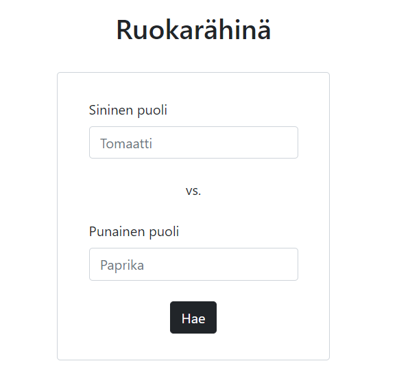
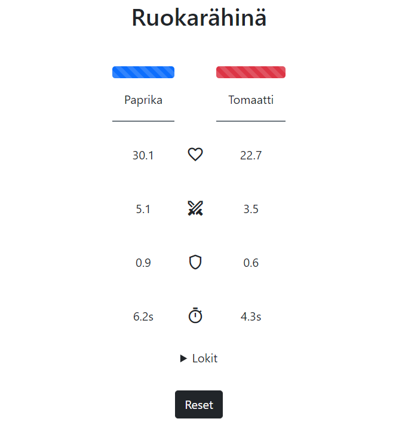
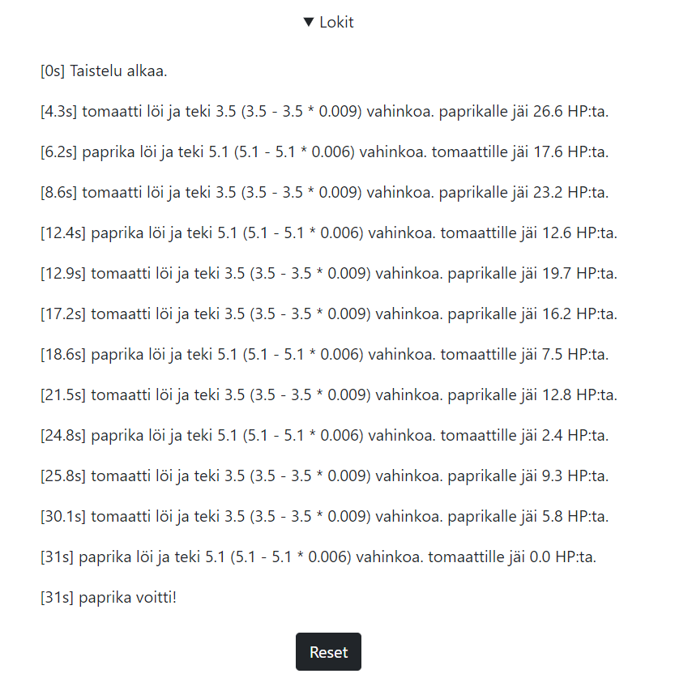

# Readme

## Mitä teknologioita olet käyttänyt ja millä käyttöjärjestelmällä?

Frontend on tehty React.js + Bootstrap 5 yhdistelmällä ja backend on toteutettu Node.js:llä käyttäen express.js framewörkkiä. Axiosta on käytetty http pyyntöjen tekemiseen frontendin ja backendin välillä sekä myös backendin ja [finelin apin](https://fineli.fi/fineli/api/v1/foods?q=omena) välilä. Windows 10:llä testattu.

## Ohjeet miten ratkaisusi pystytetään ja käynnistetään

- `git clone https://github.com/lassesuomela/ruokarahina.git` # kloonaa repo
- `cd ./backend` # mene backend kansioon
- `npm ci` # asenna dependencyt
- `npm start` # käynnistä node (starttaa porttiin 8080)
- `cd ../frontend` # mene frontend kansioon
- `npm ci` # asenna dependencyt ja keitä kahvit :D
- `npm start` # käynnistä react (käynnistyy porttiin 3000)
- avaa [localhost:3000](http://localhost:3000)
  
## Muutaman lauseen kuvaus tekemästäsi ratkaisusta

Olen vasta tänä syksynä alkanut opettelemaan Reactin + Bootstrap 5:n käyttöä, joten toteutuksesta ei kovin elegantti tullut, mutta toimivan ratkaisun sain silti tehtyä. Frontendin puolella tuli käytettyä flexboxeja Bootstrapin avulla. Vähäsen harmittaa se miten toteutin pelilogiikkani (mm. käytin kahta setInervallia enkä tehnyt molempia samassa + prop drilling). Aloitin varsin myöhään tämän projektin tekemisen (28 päivä), joten se tuli myös tehtyä aika kiireellä. Kaiken kaikkiaan oikeen mukava koodihaaste ja olisi kiva tehdä näitä myös jatkossa.

## Muuta

Haluan osallistua kilpailuun ja arvontaan sekä minuun voi ottaa yhteyttä mikäli työhaastatteluja olisi tarjolla (harjoitteluun, kesätyöhön, osa-aikaiseen, tjms, kun kuitenkin opiskelija vielä olen).

## Kuvia

